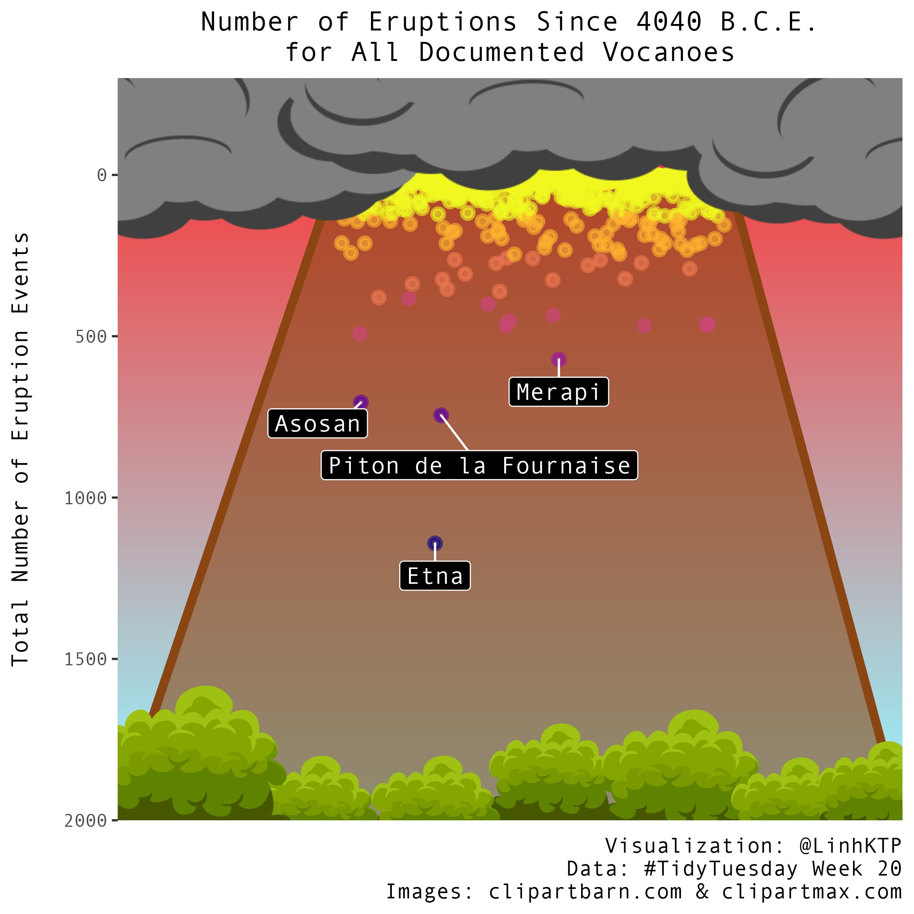

# "Wrangling Wednesday": Volcanic Eruptions

For this Carpentries Brown Bag, we will be taking a look at a dataset on volcanic eruptions published by the Smithsonian Global Volcanism Program. This dataset was a featured dataset for the [TidyTuesday](https://github.com/rfordatascience/tidytuesday) project, a weekly virtual event where data-minded folks work on the same dataset to practice their data wrangling and visualization skills.

The TidyTuesday writeup and data repository is available here: https://github.com/rfordatascience/tidytuesday/tree/master/data/2020/2020-05-12

We have found several visualizations that TidyTuesday participants produced from this dataset and shared on Twitter. For this Brown Bag, we will take a look at these visualizations, pick one of particular interest, and work together as a group to figure out how to recreate it!

## Visualization 1: Average population living within 5km of a volcano

From [@berndatte_john](https://twitter.com/berndatte_john/status/1262734021370343424):

<blockquote class="twitter-tweet">
My first work for <a href="https://twitter.com/hashtag/TidyTuesday?src=hash&amp;ref_src=twsrc%5Etfw">#TidyTuesday</a>, exploring the Volcano Eruption data set.The code is in the link <a href="https://t.co/7J0Vtroir2">https://t.co/7J0Vtroir2</a> <a href="https://t.co/UB7Ur6YTht">pic.twitter.com/UB7Ur6YTht</a>
&mdash; Berndatte John (@berndatte_john) <a href="https://twitter.com/berndatte_john/status/1262734021370343424?ref_src=twsrc%5Etfw">May 19, 2020</a></blockquote>

## Visualization 2: Volcanic rock type by elevation

From [@curiekphd](https://twitter.com/curiekphd/status/1260087308050591745):

<blockquote class="twitter-tweet">
My 1st ever <a href="https://twitter.com/hashtag/TidyTuesday?src=hash&amp;ref_src=twsrc%5Etfw">#TidyTuesday</a> inspired by <a href="https://twitter.com/JodieLord5?ref_src=twsrc%5Etfw">@JodieLord5</a>! Wanted to do a map of eruptions but it was too ambitious for this R newbie. So went with v basic ridge plots instead mostly cause they kinda look like volcanoes... Feedback appreciated! Code: <a href="https://t.co/9vYWgHHqq7">https://t.co/9vYWgHHqq7</a><a href="https://twitter.com/hashtag/r4ds?src=hash&amp;ref_src=twsrc%5Etfw">#r4ds</a> <a href="https://twitter.com/hashtag/DataViz?src=hash&amp;ref_src=twsrc%5Etfw">#DataViz</a> <a href="https://t.co/owVH8WWyqD">pic.twitter.com/owVH8WWyqD</a>
&mdash; Curie Kim (@curiekphd) <a href="https://twitter.com/curiekphd/status/1260087308050591745?ref_src=twsrc%5Etfw">May 12, 2020</a></blockquote>

Vignette on [making ridgeline plots with the `ggridges` package](https://cran.r-project.org/web/packages/ggridges/vignettes/introduction.html)

## Visualization 3: Map volcanoes by type

From [@dokatox](https://twitter.com/dokatox/status/1261054505602473989):

<blockquote class="twitter-tweet">
My take on volcano data 🌋from this week&#39;s <a href="https://twitter.com/hashtag/TidyTuesday?src=hash&amp;ref_src=twsrc%5Etfw">#TidyTuesday</a>. Maps of main volcanoes types. Size represents population within 10 km. Inspired by great <a href="https://twitter.com/alexcookson?ref_src=twsrc%5Etfw">@alexcookson</a> animations. <a href="https://twitter.com/hashtag/rstats?src=hash&amp;ref_src=twsrc%5Etfw">#rstats</a> <a href="https://t.co/kgL7jaLsGL">https://t.co/kgL7jaLsGL</a> <a href="https://t.co/Ov1aM63kD2">pic.twitter.com/Ov1aM63kD2</a>
&mdash; Dominik Krzemiński (@dokatox) <a href="https://twitter.com/dokatox/status/1261054505602473989?ref_src=twsrc%5Etfw">May 14, 2020</a></blockquote>

Tutorial on [creating maps in R](https://amdevine.github.io/cbb-r-mapping/).

Tutorial on [getting map data from rnaturalearth](https://www.r-spatial.org/r/2018/10/25/ggplot2-sf.html).

## Bonus Visualization: 

We won't have time to add the pretty graphical elements, but this one was too fun to not share!

From [@LinhKTP](https://twitter.com/LinhKTP/status/1261061501525229568):

<blockquote class="twitter-tweet">
Hello <a href="https://twitter.com/hashtag/TidyTuesday?src=hash&amp;ref_src=twsrc%5Etfw">#TidyTuesday</a> community! This week, I made an MS-paint-tier volcano in <a href="https://twitter.com/hashtag/rstats?src=hash&amp;ref_src=twsrc%5Etfw">#rstats</a> from the volcanoes data. See the thread below for the plots that were my inspiration.  Code: <a href="https://t.co/mDEPLAWaHO">https://t.co/mDEPLAWaHO</a> <a href="https://t.co/X4zbu9zP0n">pic.twitter.com/X4zbu9zP0n</a>
&mdash; Linh (@LinhKTP) <a href="https://twitter.com/LinhKTP/status/1261061501525229568?ref_src=twsrc%5Etfw">May 14, 2020</a></blockquote>

