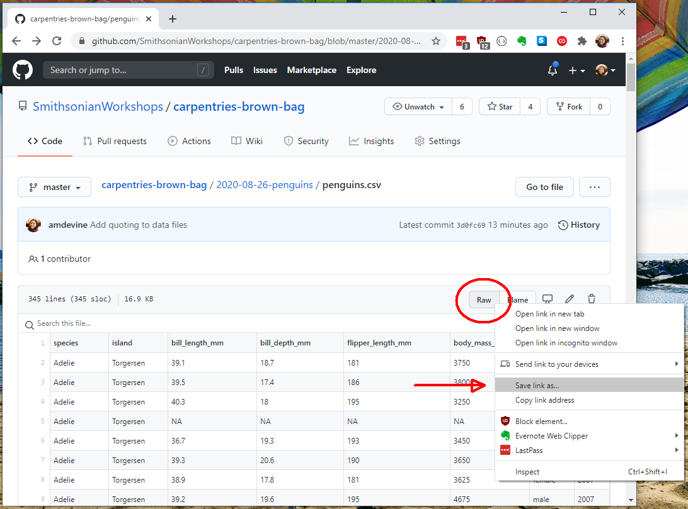
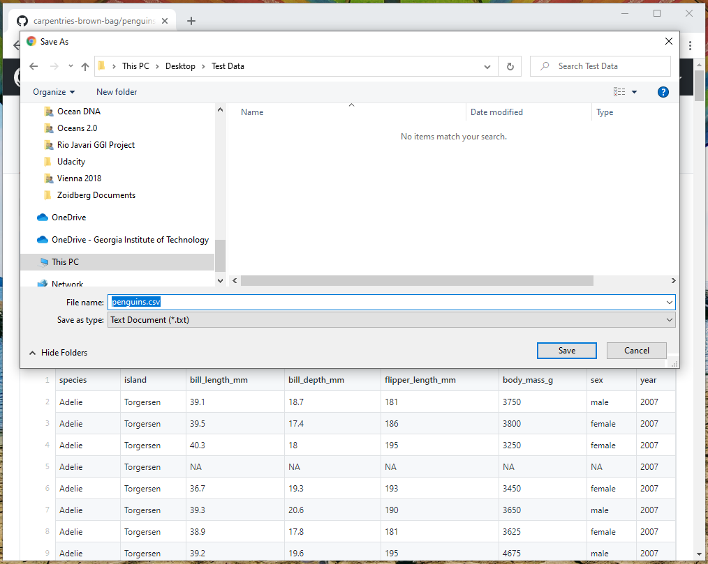

# SI Carpentries Brown Bag: Palmer Penguins

This month we are tackling another dataset provided by the [Tidy Tuesday](https://github.com/rfordatascience/tidytuesday) project: a dataset on Antarctic penguins. This dataset contains measurements on bill length, bill depth, flipper length, body mass, sex, and year for three species found on three islands in the Palmer Archipelago, Antarctica.

A link to the Tidy Tuesday writeup and instructions can be found here: https://github.com/rfordatascience/tidytuesday/blob/master/data/2020/2020-07-28/readme.md

For this month, we ask that participants take a look at the dataset ahead of time and try their hands at creating a visualization using the programming language or software of their choice. On Wednesday, we can get together, show off the visualizations we created (which do not need to be fancy!), and discuss any questions that may arise. 

Whether you're fresh from completing a Data Carpentry workshop (hello August workshop participants!) or you're a grizzled, seasoned veteran, working on an actual project is the best way to reinforce the skills you've learned and experiment with new, exciting ways of doing things. This is a great opportunity to put your skills into effect and be able to show off your hard work at the end!

## Data

The dataset we will be working with can be found here: https://github.com/allisonhorst/palmerpenguins.

Per the repository, these data are available by CC-0 license, so they can be used freely for any project and any use!

### R

For those working in R, the data are available as an R package. First, install the package. This only needs to be done once.

~~~
install.packages("palmerpenguins")
~~~

Now, whenever you want to use the palmerpenguins dataset, you can load it into your R environment with the library() and data() functions.

~~~
library(palmerpenguins)
data(package = 'palmerpenguins')
~~~

You will now have two data frames available for use: `penguins` and `penguins_raw`.

### Python

`penguins` and `penguins_raw` can be imported into Python from this repository using the pandas package.

~~~
import pandas as pd

penguins = pd.read_csv('https://raw.githubusercontent.com/SmithsonianWorkshops/carpentries-brown-bag/master/2020-08-26-penguins/penguins.csv')

penguins_raw = pd.read_csv('https://raw.githubusercontent.com/SmithsonianWorkshops/carpentries-brown-bag/master/2020-08-26-penguins/penguins_raw.csv')
~~~

### Other software

You can also download these data as CSV files and import them into the analysis/visualization software of your choice.

To do this, click on the link to the file in the file list above. This will take you to a GitHub page where the data have been automatically parsed and displayed nicely as a table.

At the upper right of the table, there is a button labaled Raw. **Right-click** this button to bring up a menu of options.

One of the options will be "Save link as..." or "Save target as...". **Left-click** to select this menu option, which will take you to a file download dialog.

By default, your file may be named `penguins.txt` or `penguins_raw.txt`. When saving the file, edit the name to save the file as a CSV file instead.

Save the file in the desired location. You should now be able to import it into another program (e.g. Excel, Tableau, OpenRefine, DB Browser, etc.)
